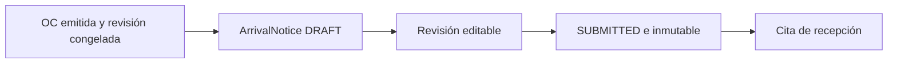

# Arquitectura inbound

La arquitectura sigue `domain / application / infrastructure / presentation`. Los servicios de aplicación coordinan invariantes, locks, snapshots, auditoría e idempotencia; FastAPI sólo adapta contratos HTTP.

Los módulos reutilizados se referencian por UUID y snapshot; no se duplican catálogos.

