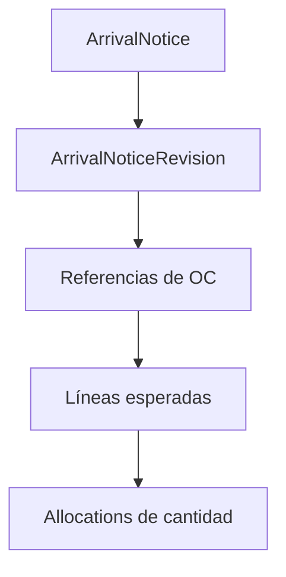

# Modelo ArrivalNotice

`arrival_notices` contiene identidad, alcance organizacional, almacén, proveedor, transportista opcional, fecha esperada y resúmenes de carga. El detalle mutable vive en una revisión.

Los punteros `active_revision_id` y `confirmed_revision_id` usan FK diferidas para resolver el ciclo de creación sin perder integridad.

