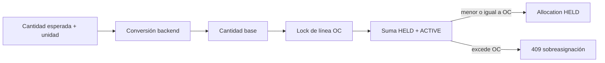

# Líneas esperadas y allocations

La cantidad se recibe como string decimal, se convierte mediante el motor de unidades y se guarda junto con cantidad base, unidad base, factor y regla utilizada.

La unicidad por línea esperada y el lock pesimista evitan doble reserva concurrente. Cancelar libera la allocation; enviar la activa.

