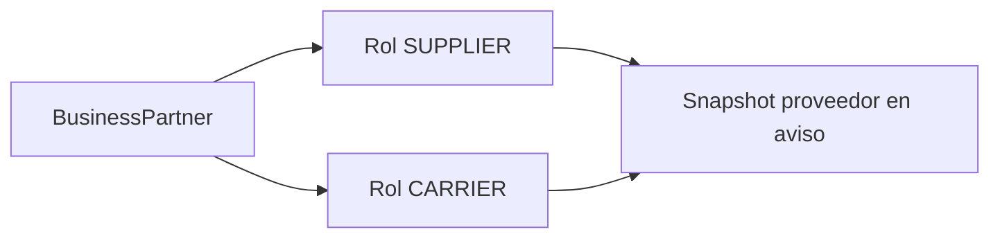

# Proveedor y transportista

El proveedor es obligatorio y debe tener rol `SUPPLIER` activo. El transportista es opcional y, cuando se declara, debe tener rol `CARRIER` activo. Ambos se resuelven desde socios de negocio existentes.

El snapshot evita que cambios posteriores del maestro alteren una revisión ya congelada.

