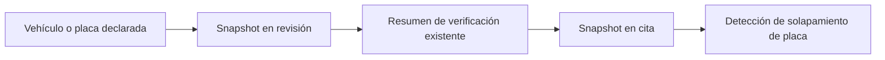

# Vehículo y placa

El aviso puede referenciar un vehículo maestro o declarar datos excepcionales. Se guarda placa normalizada y snapshot; no se crea un maestro nuevo de forma implícita.

La verificación representa información existente o declarada; el backend no afirma una consulta externa inexistente.

