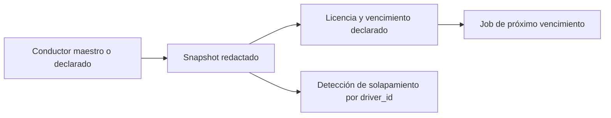

# Conductor y licencia

El conductor puede provenir del maestro existente o ser una declaración excepcional autorizada. Se capturan nombre, identificadores redactados, categoría y vencimiento declarado.

El job no equivale a validación ante una autoridad externa; sólo evalúa el snapshot capturado.

