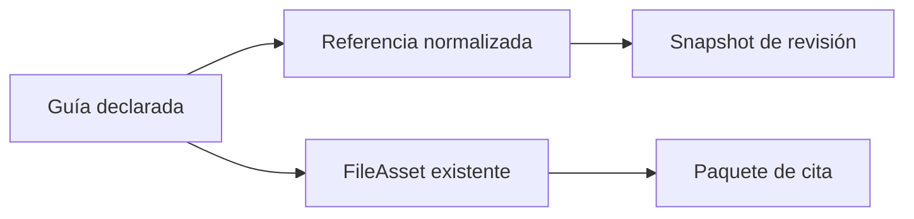

# Documentos de transporte y guías

Cada documento conserva tipo, emisor, serie, número, referencia normalizada, fechas, estado de verificación y archivo opcional. La combinación revisión/tipo/referencia es única.

Los archivos reutilizan el módulo de evidencias. `NOT_VERIFIED` es válido y no se transforma en una afirmación de verificación externa.

