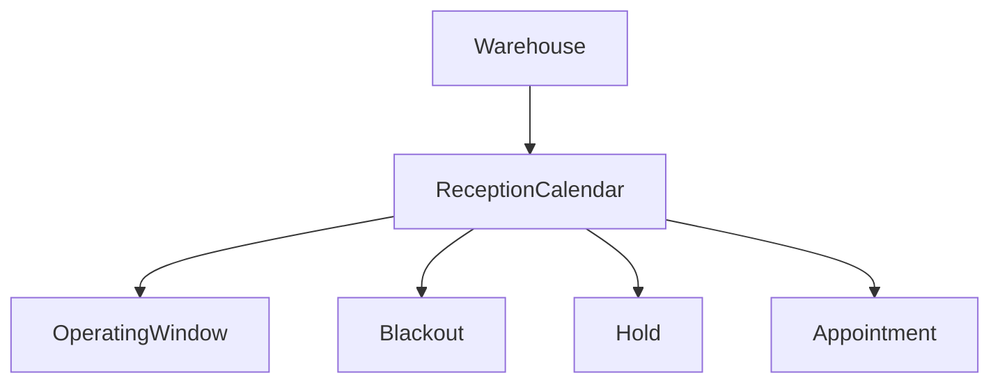

# Calendario de recepción

Cada almacén puede tener un calendario principal activo. El calendario define zona horaria IANA, anticipación mínima/máxima, duración de slot, capacidad por defecto, duración de holds y límites de reprogramación/cancelación.

Los estados son `DRAFT`, `ACTIVE`, `INACTIVE` y `ARCHIVED`.

