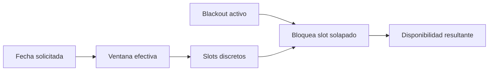

# Horarios y blackouts

Las ventanas operativas aplican por día de semana y rango de vigencia. Se rechazan solapamientos incompatibles. Los blackouts son rangos absolutos con motivo y estado.

Un job emite un evento persistente cuando un blackout nuevo afecta una cita existente; no cancela automáticamente la cita.

