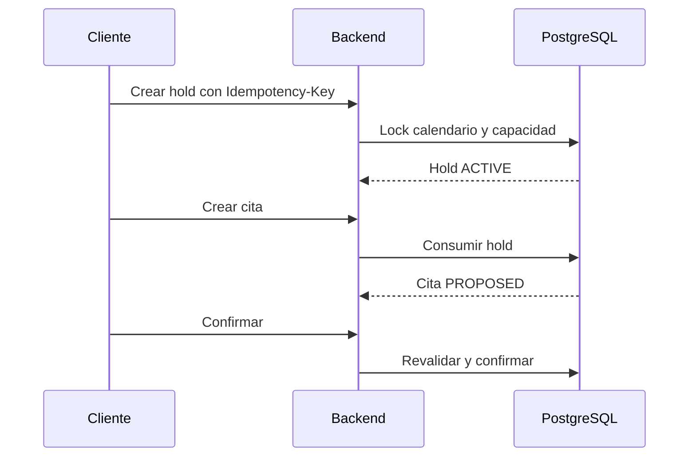

# Holds

Un hold reserva temporalmente capacidad para un aviso listo para programación. Sólo puede existir un hold activo por aviso; expira según el calendario y tiene un máximo de renovaciones.

El job de expiración cambia `ACTIVE` a `EXPIRED` y registra un evento de outbox.

