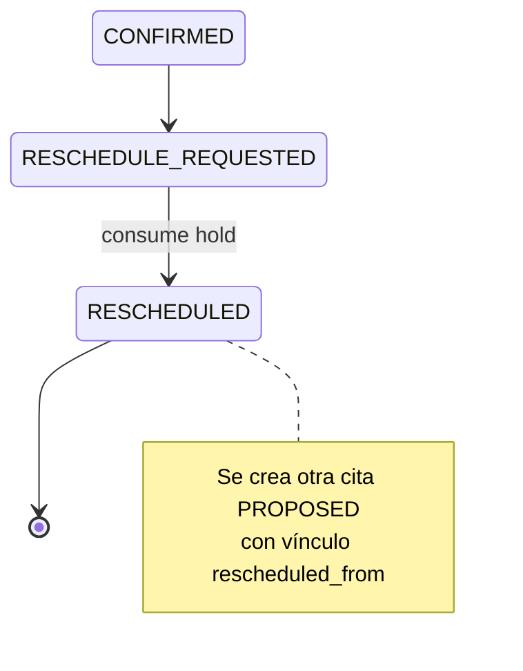
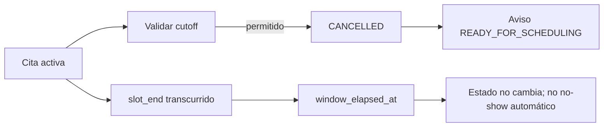

# Reprogramación

La reprogramación requiere una cita confirmada, respetar el cutoff y consumir un hold válido del mismo aviso. Se crea una cita reemplazo y la anterior queda `RESCHEDULED`; nunca se reescribe el slot histórico.

Solicitud y ejecución son idempotentes y quedan en historial, auditoría y outbox.

La cancelación exige motivo, permiso con step-up e idempotencia. Si la cita era la activa del aviso, éste vuelve a `READY_FOR_SCHEDULING`.

El job de ventana transcurrida no declara `NO_SHOW`, porque eso requiere evidencia de una fase física posterior.
