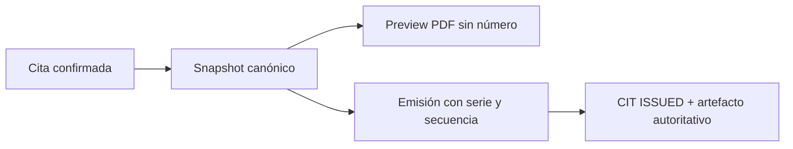

# Snapshot y documento CIT

El snapshot de la cita reúne aviso/revisión, OC, líneas, carga, transporte, horario y requisitos. Su hash permite demostrar qué datos generaron el documento.

Se reutiliza `DocumentLifecycleService`. Preview nunca asigna número, serie ni instancia emitida. La emisión es idempotente y el PDF autoritativo queda en almacenamiento documental.

