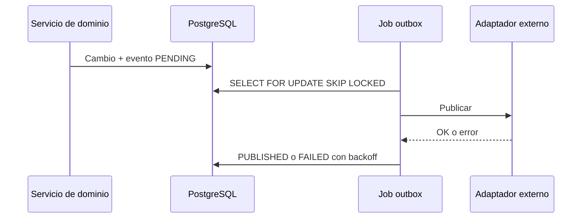

# Notificaciones y outbox

Los cambios de estado y recordatorios generan eventos en `arrival_notice_outbox_events` dentro de la misma transacción. La clave de deduplicación es única por tenant.

El adaptador externo es intercambiable. Sin adaptador configurado, el límite local permite pruebas deterministas sin afirmar que se envió correo/SMS.

