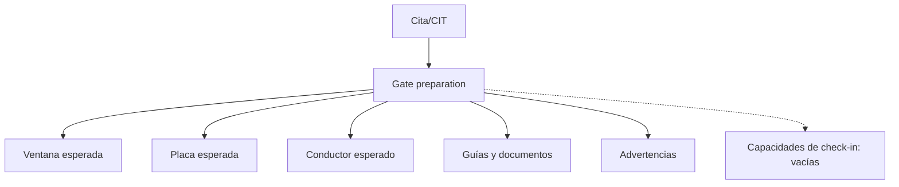

# Contrato para control de puerta

`GET /reception-appointments/{id}/gate-preparation` entrega información de preparación, no ejecuta check-in.

La Fase 037 podrá consumir este contrato, pero deberá crear sus propias entidades y permisos físicos.

