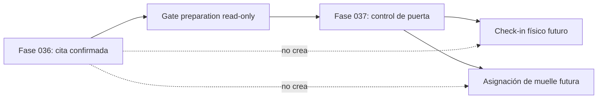

# Integración futura con Fase 037

Fase 037 podrá leer la cita confirmada, CIT y `gate-preparation`. No debe inferir check-in a partir de `window_elapsed_at`.

Los permisos y entidades físicas deberán pertenecer a Fase 037.

