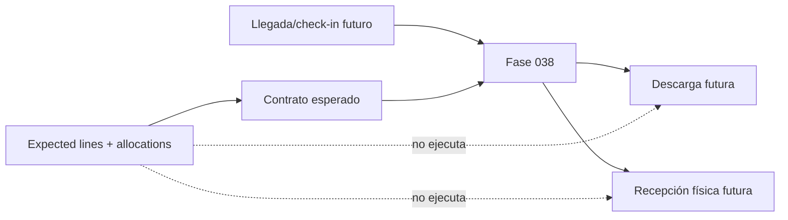

# Integración futura con Fase 038

Fase 038 podrá partir de una llegada validada por Fase 037 y contrastarla con las líneas esperadas congeladas.

Esta fase no crea diferencias recibidas ni modifica allocations con cantidades físicas.

