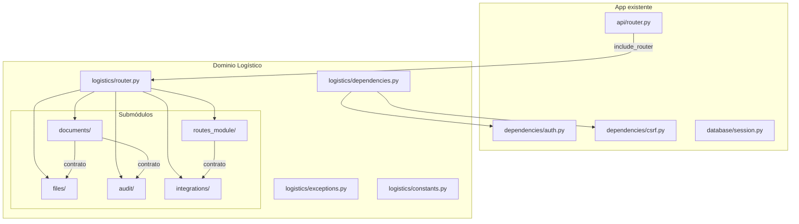
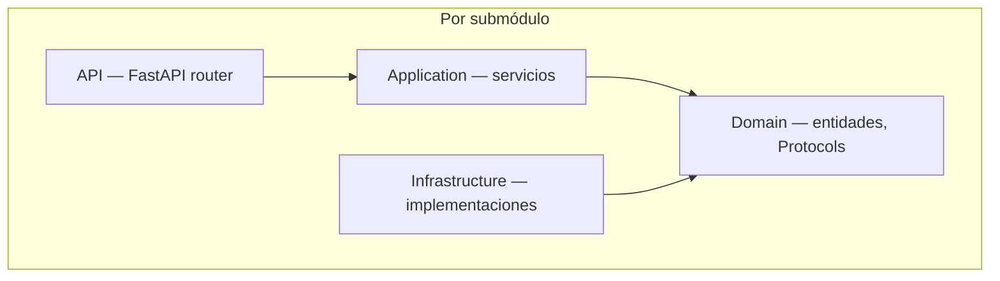
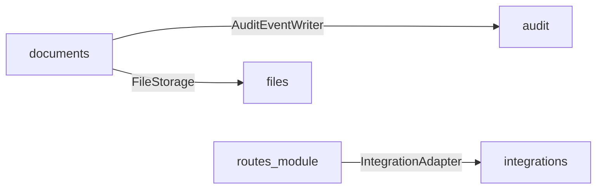
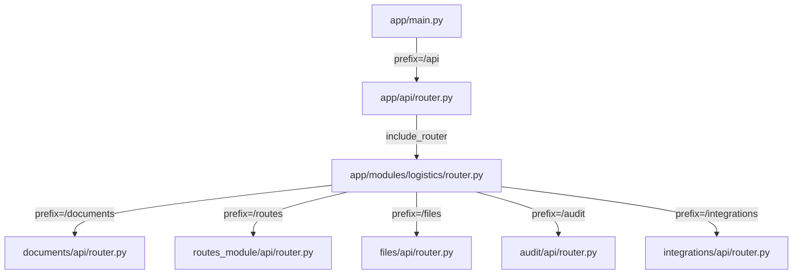
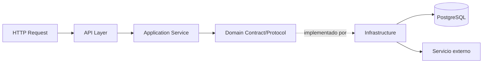
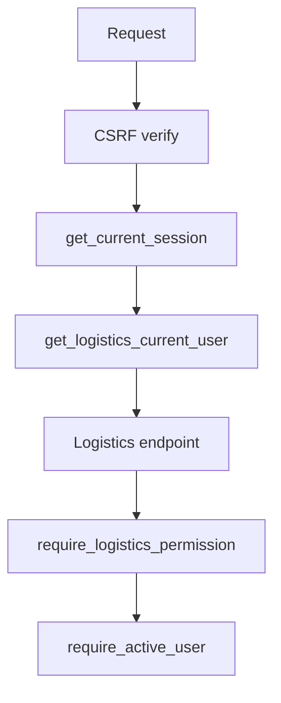
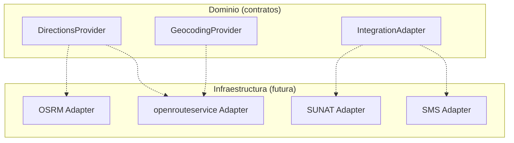
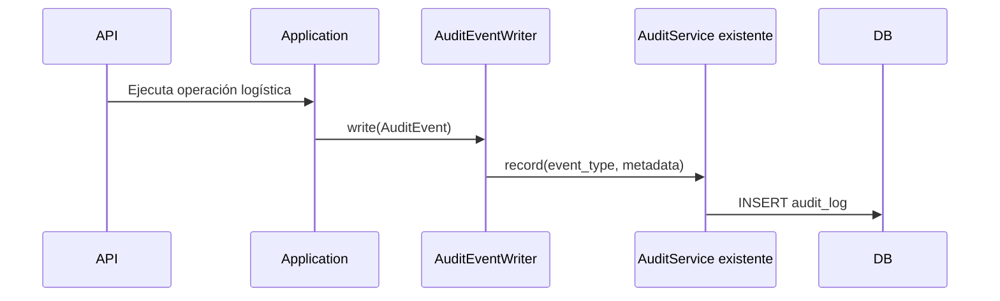

# Diagramas Mermaid — Fase 003

## 1. Arquitectura General

## 2. Capas del Dominio Logístico

## 3. Dependencias entre Módulos

## 4. Registro de Routers

## 5. Flujo API → Aplicación → Dominio → Infraestructura

## 6. Integración con Autenticación

## 7. Adaptadores de Proveedores Externos

## 8. Flujo Futuro de Auditoría

