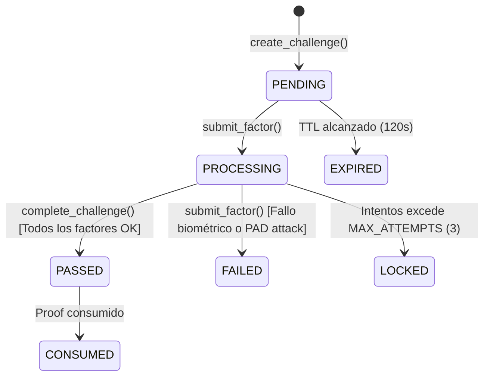

# 04 — Ciclo de Vida de StepUpChallenge

## Ciclo de Estados

## Límites e Intentos
* **TTL por defecto:** 120 segundos.
* **Máximo de intentos:** 3. Superar este límite transiciona el desafío a `LOCKED` y eleva el nivel de riesgo de la sesión.
