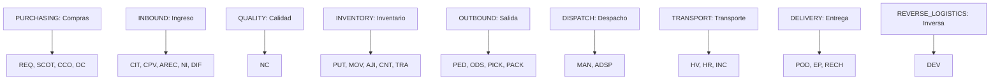

# 02 — Catálogo de Familias Documentales

## Familias Registradas

## Lista Completa de Familias (13 Familias)
1. `PURCHASING` — Compras (`purchases`)
2. `INBOUND` — Ingreso y Recepción (`inbound`)
3. `QUALITY` — Calidad (`quality`)
4. `INVENTORY` — Inventario (`inventory`)
5. `OUTBOUND` — Salida (`outbound`)
6. `DISPATCH` — Despacho (`dispatches`)
7. `TRANSPORT` — Transporte (`trips`)
8. `DELIVERY` — Entrega (`deliveries`)
9. `REVERSE_LOGISTICS` — Logística Inversa (`returns`)
10. `EXTERNAL_COMMERCIAL` — Documentos comerciales externos (`external_documents`)
11. `EXTERNAL_VEHICLE` — Documentación vehicular externa (`external_documents`)
12. `EXTERNAL_DRIVER` — Documentación del conductor (`external_documents`)
13. `EXTERNAL_QUALITY` — Certificados externos de calidad (`external_documents`)
