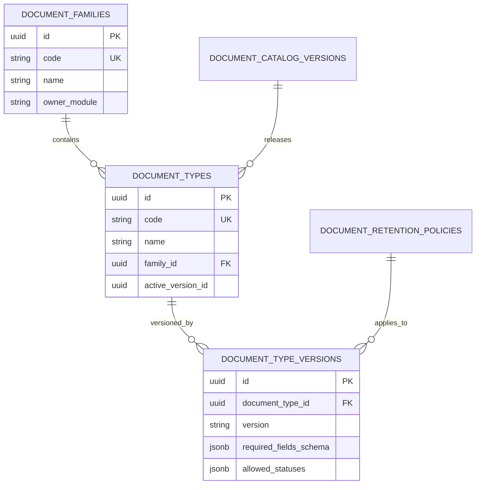

# 06 — Modelo de Datos del Catálogo Documental

## Relaciones Entidad-Relación (Mermaid)

## Definición de Tablas Principales
* `document_families`: Almacena las 13 familias de clasificación.
* `document_types`: Almacena los tipos documentales del catálogo (28 tipos activos).
* `document_type_versions`: Contratos inmutables de esquema y reglas por versión de tipo documental.
* `document_retention_policies`: Reglas de conservación legal y operativa.
* `document_catalog_versions`: Historial de liberaciones del catálogo global (SemVer).
