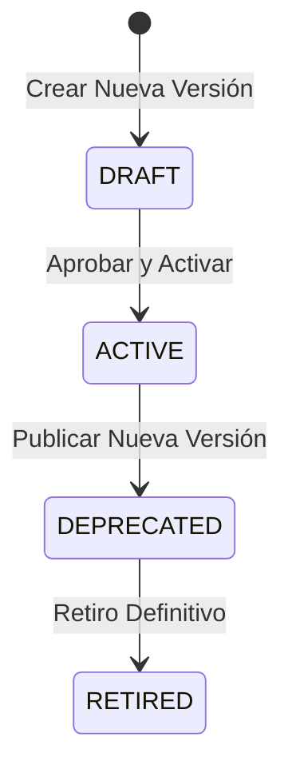

# 07 — Versionado SemVer e Inmutabilidad de Versiones Activas

## Ciclo de Vida de Versiones (Mermaid)

## Reglas de Inmutabilidad
1. Una versión en estado `ACTIVE` **NUNCA** se modifica directamente.
2. Para aplicar cambios en el esquema de campos o reglas de un tipo documental:
   * Se crea una nueva versión en estado `DRAFT` (ejemplo `1.1.0`).
   * Se valida mediante `validate_catalog()`.
   * Al activarse, la versión anterior pasa a `DEPRECATED` y la nueva se convierte en `ACTIVE`.
