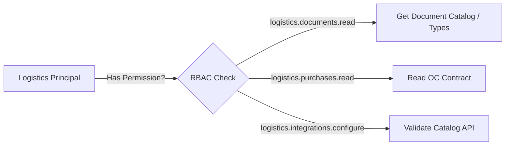

# 10 — Políticas de Permisos y Sensibilidad

## Mapeo de Permisos RBAC por Tipo Documental

## Clasificación de Sensibilidad
* **`PUBLIC_LIMITED`**: Verificación pública limitada.
* **`INTERNAL`**: Uso interno ordinario.
* **`CONFIDENTIAL`**: Cuadro comparativo (CCO), Orden de compra (OC), Acta de ajuste (AJI), Hoja de ruta (HR).
* **`RESTRICTED`**: Prueba de entrega (POD), Acta parcial (EP), Acta de rechazo (RECH), Control de puerta (CPV).
