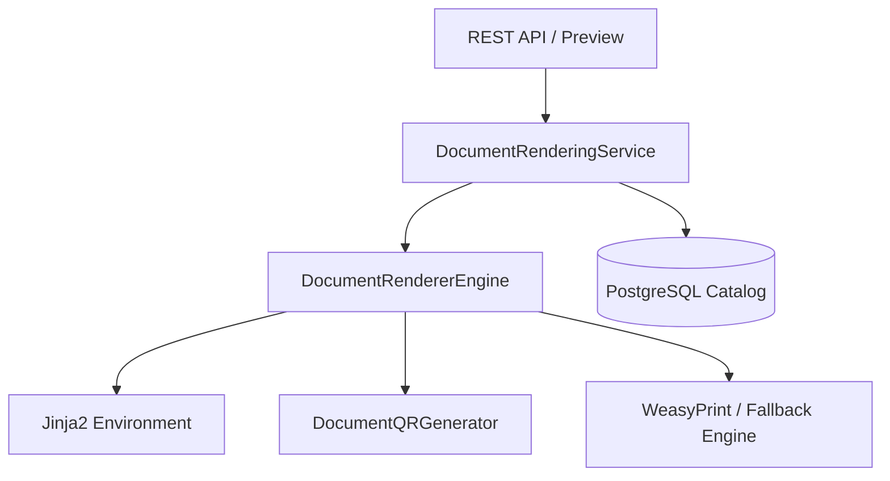

# 03 — Arquitectura del Motor Documental

## Diagrama de Capas

```mermaid
graph TD
    Client[REST API / Preview] --> Service[DocumentRenderingService]
    Service --> Engine[DocumentRendererEngine]
    Engine --> Jinja[Jinja2 Environment]
    Engine --> QR[DocumentQRGenerator]
    Engine --> PDF[WeasyPrint / Fallback Engine]
    Service --> DB[(PostgreSQL Catalog)]
```
