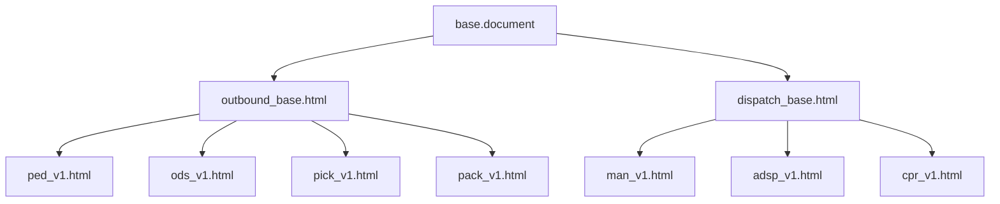

# Arquitectura de Plantillas de Salida (Phase 018)

## Herencia de Plantillas
Todas las plantillas extienden el motor común `base.document` o están construidas de forma autónoma importando los estilos compartidos:
- `shared/print.css` (Phase 014)
- `outbound/shared/outbound.css` (Phase 018)
- `dispatch/shared/dispatch.css` (Phase 018)

## Jerarquía de Plantillas y Herencia

