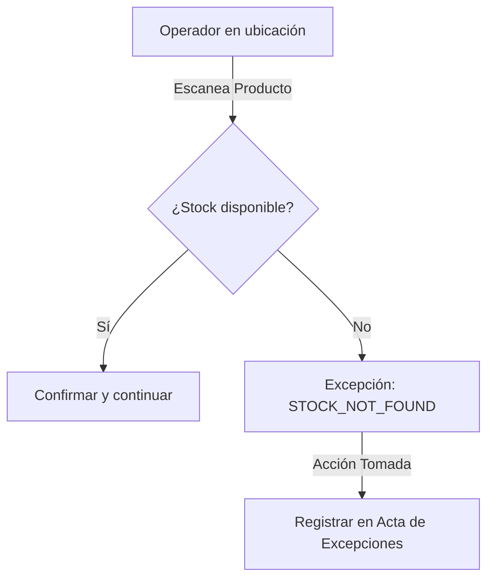

# PICK — Lista de Picking (Phase 018)

## Propósito
Indica al operador del almacén qué artículos recoger, en qué ubicaciones y en qué orden de recorrido.

## Excepciones de Picking
Permite documentar discrepancias físicas en el almacén como `STOCK_NOT_FOUND`, `LOCATION_EMPTY`, etc.

## Flujo de Excepciones

