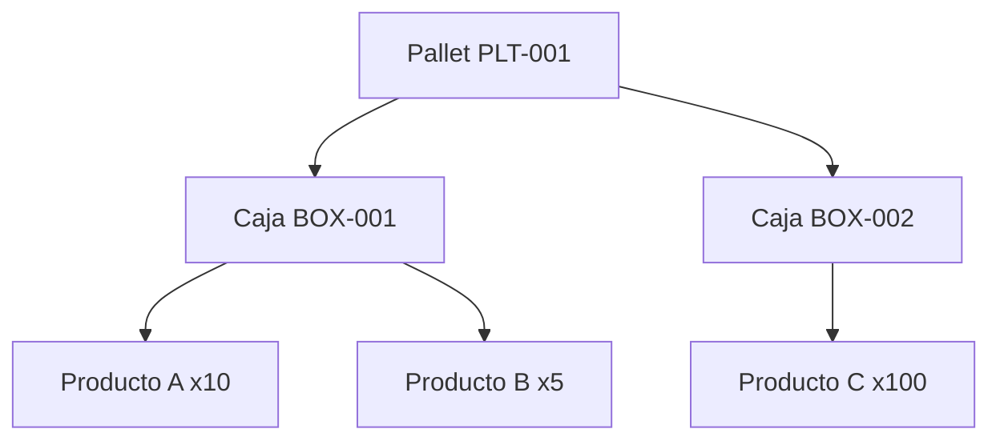

# PACK — Packing List (Phase 018)

## Propósito
Representar la consolidación física de los artículos dentro de unidades logísticas de despacho (cajas, pallets, contenedores).

## Jerarquía de Packing

## Validación
- Evita referencias cíclicas de padres e hijos mediante `PackageHierarchyValidator`.
- Asegura que el peso bruto sea mayor o igual al peso neto.
