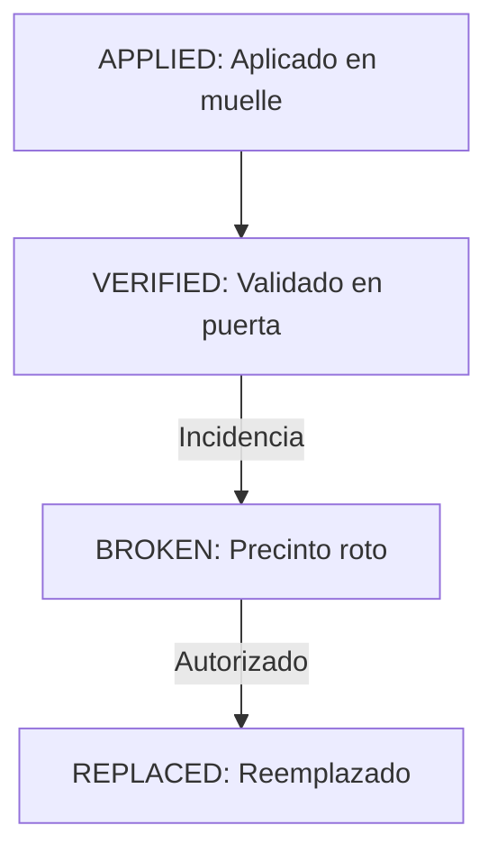

# CPR — Control de Precinto (Phase 018)

## Propósito
Registra y audita la colocación, verificación e integridad de los precintos de seguridad aplicados a la carga del vehículo.

## Historial de Eventos del Precinto

