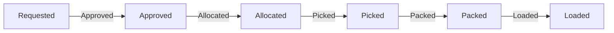

# Validaciones y Coherencia (Phase 018)

## Flujo de Cantidades

## Reglas de Negocio
- `approved_quantity <= requested_quantity`
- `allocated_quantity <= approved_quantity`
- `picked_quantity <= allocated_quantity`
- `packed_quantity <= picked_quantity`
- `loaded_quantity <= packed_quantity`
- `gross_weight >= net_weight`
