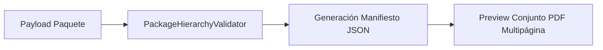

# Paquete Documental (Phase 018)

## Modos del Paquete
Consolida múltiples documentos según la etapa del despacho:
- `OUTBOUND_REQUEST`: PED
- `OUTBOUND_AUTHORIZATION`: PED + ODS
- `PICKING`: ODS + PICK
- `PACKING`: ODS + PICK + PACK
- `DISPATCH`: MAN + ADSP
- `TRANSPORT_HANDOFF`: MAN + ADSP + CPR

## Flujo de Generación de Preview Conjunto

