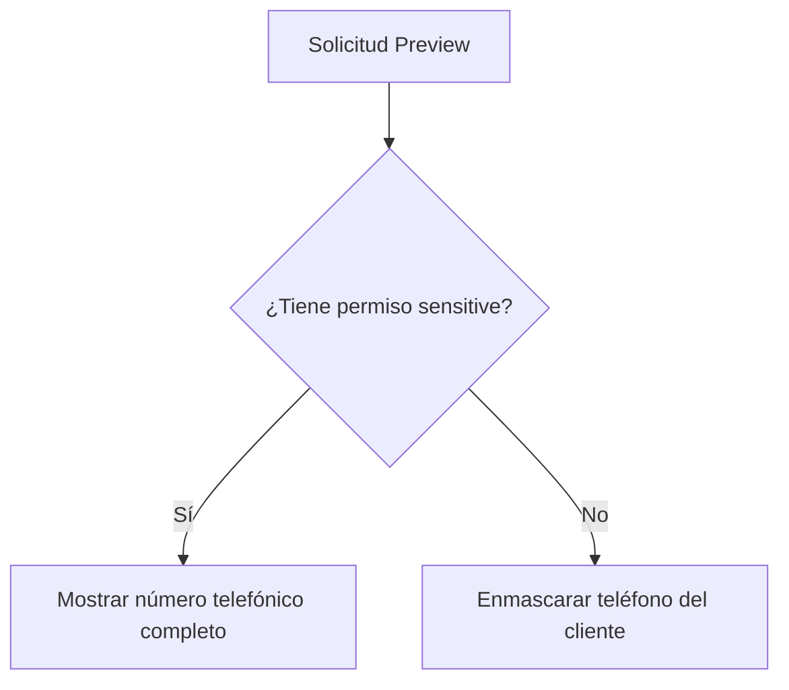

# Privacidad de Datos Sensibles (Phase 018)

## Enmascaramiento del Conductor
DNI y licencias del conductor se enmascaran en el backend usando la función `mask_driver_id`:
- DNI `12345678` -> `******78`
- Licencia `Q49876521` -> `*******21`

## Gating de Datos de Clientes y Destino

