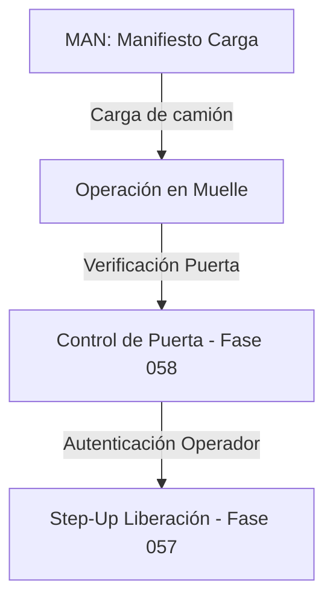

# Integración con Despacho y Transporte (Fases Posteriores)

## Fases 055 a 060

## Integración con Transporte
Asignación y validación en tiempo real del SOAT y revisiones técnicas a través de la integración de transportes (Fase 059).
