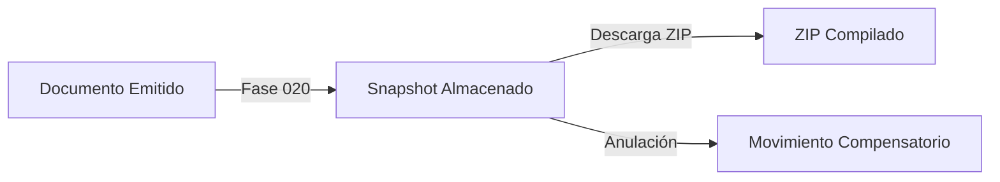

# Contrato con la Fase 020 (Reimpresión y Anulación)

## Integración con Fase 020
Los documentos diseñados en esta fase (PED, ODS, PICK, PACK, MAN, ADSP, CPR) se registrarán en el catálogo general, convirtiéndose en candidatos para las siguientes funcionalidades:
- Reimpresión de documentos oficiales mediante snapshots inmutables.
- Proceso de anulación con generación de movimiento compensatorio automático.
- Compresión en archivo ZIP para descarga masiva de despachos consolidados.

