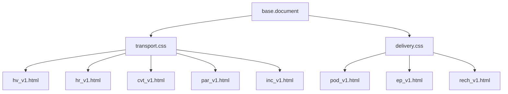

# Arquitectura de Plantillas (Phase 019)

## Herencia de Plantillas
Todas las plantillas extienden el motor común `base.document` o están construidas de forma autónoma importando los estilos compartidos:
- `shared/print.css`
- `transport/shared/transport.css`
- `delivery/shared/delivery.css`

## Jerarquía de Plantillas y Herencia

