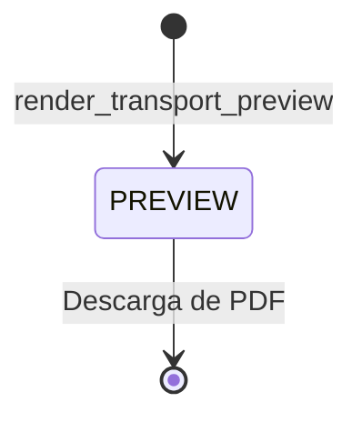

# HV — Hoja de Viaje (Phase 019)

## Propósito
La Hoja de Viaje (HV) documenta el plan de viaje global, incluyendo vehículo, conductor, transportista y el itinerario de paradas secuenciales.

## Diagrama de Ciclo de Vida

