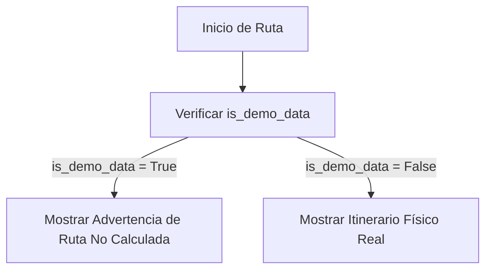

# HR — Hoja de Ruta (Phase 019)

## Propósito
La Hoja de Ruta (HR) detalla el itinerario físico, distancias estimadas, duraciones de trayecto y restricciones.

## Flujo de Cálculo y Validación

```mermaid
flowchart TD
    Start[Inicio de Ruta] --> Verify[Verificar is_demo_data]
    Verify -->|is_demo_data = True| Warning[Mostrar Advertencia de Ruta No Calculada]
    Verify -->|is_demo_data = False| ShowRoute[Mostrar Itinerario Físico Real]
```
