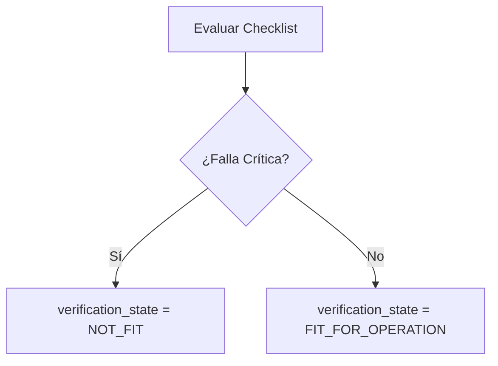

# CVT — Control Vehicular de Transporte (Phase 019)

## Propósito
Inspección preoperacional para validar el estado físico del vehículo antes de salir del patio.

## Reglas de Decisión

```mermaid
flowchart TD
    Check[Evaluar Checklist] --> CriticalFail{¿Falla Crítica?}
    CriticalFail -->|Sí| StateNotFit[verification_state = NOT_FIT]
    CriticalFail -->|No| StateFit[verification_state = FIT_FOR_OPERATION]
```
