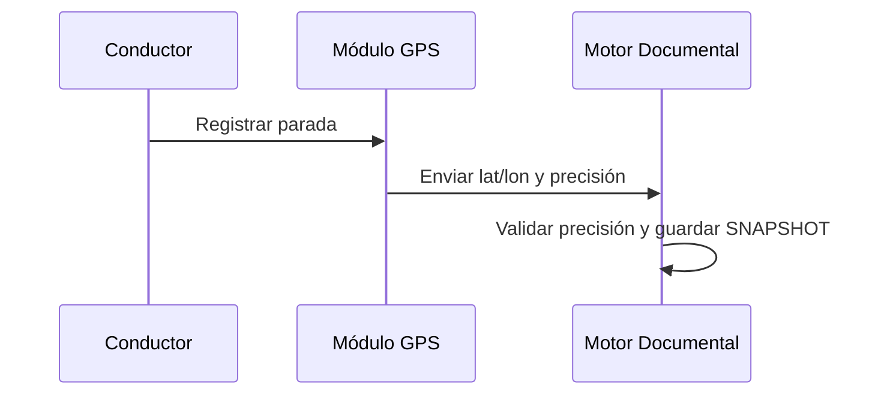

# PAR — Constancia de Parada (Phase 019)

## Propósito
Constata la llegada, permanencia y salida de un vehículo en un checkpoint o punto de entrega de la ruta.

## Flujo de Registro

```mermaid
sequenceDiagram
    participant Driver as Conductor
    participant GPS as Módulo GPS
    participant Engine as Motor Documental
    Driver->>GPS: Registrar parada
    GPS->>Engine: Enviar lat/lon y precisión
    Engine->>Engine: Validar precisión y guardar SNAPSHOT
```
