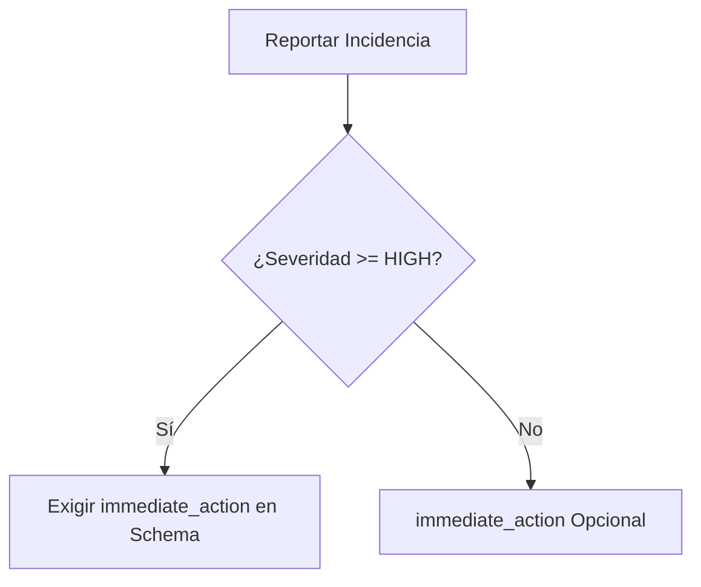

# INC — Reporte de Incidencia (Phase 019)

## Propósito
Documentar eventos imprevistos que afecten la ruta, tiempos o estado de la carga.

## Flujo de Severidad

```mermaid
flowchart TD
    Incident[Reportar Incidencia] --> Severity{¿Severidad >= HIGH?}
    Severity -->|Sí| RequireAction[Exigir immediate_action en Schema]
    Severity -->|No| OptionalAction[immediate_action Opcional]
```
