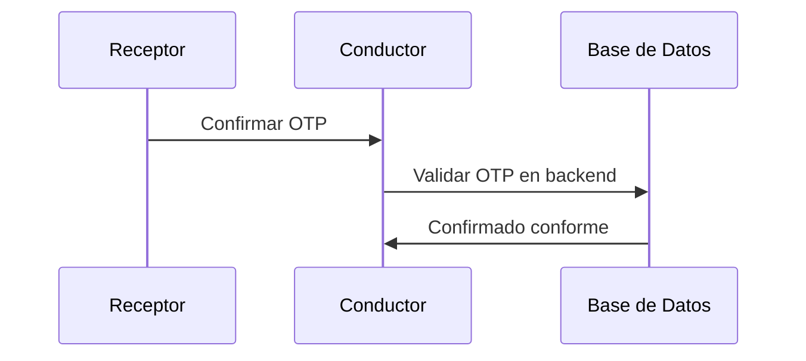

# POD — Prueba de Entrega (Phase 019)

## Propósito
Prueba de Entrega (Proof of Delivery) firmada por el receptor con validación OTP opcional.

## Flujo de Validación de POD

```mermaid
sequenceDiagram
    participant Receptor
    participant Driver as Conductor
    participant DB as Base de Datos
    Receptor->>Driver: Confirmar OTP
    Driver->>DB: Validar OTP en backend
    DB->>Driver: Confirmado conforme
```
