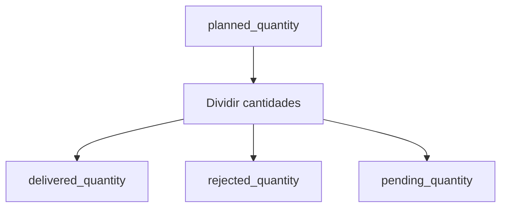

# EP — Acta de Entrega Parcial (Phase 019)

## Propósito
Documentar entregas donde una parte del pedido es rechazada o queda pendiente.

## División de Cantidades

```mermaid
flowchart TD
    Planned[planned_quantity] --> Split[Dividir cantidades]
    Split --> Delivered[delivered_quantity]
    Split --> Rejected[rejected_quantity]
    Split --> Pending[pending_quantity]
```
