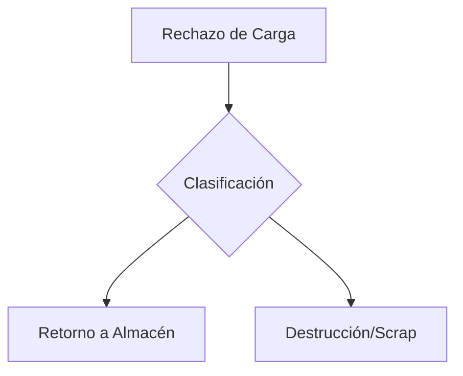

# RECH — Acta de Rechazo (Phase 019)

## Propósito
Documentar el rechazo completo de la entrega por parte del cliente, detallando motivos.

## Flujo de Destinación

```mermaid
flowchart TD
    Rejection[Rechazo de Carga] --> Classification{Clasificación}
    Classification --> Return[Retorno a Almacén]
    Classification --> Scrap[Destrucción/Scrap]
```
