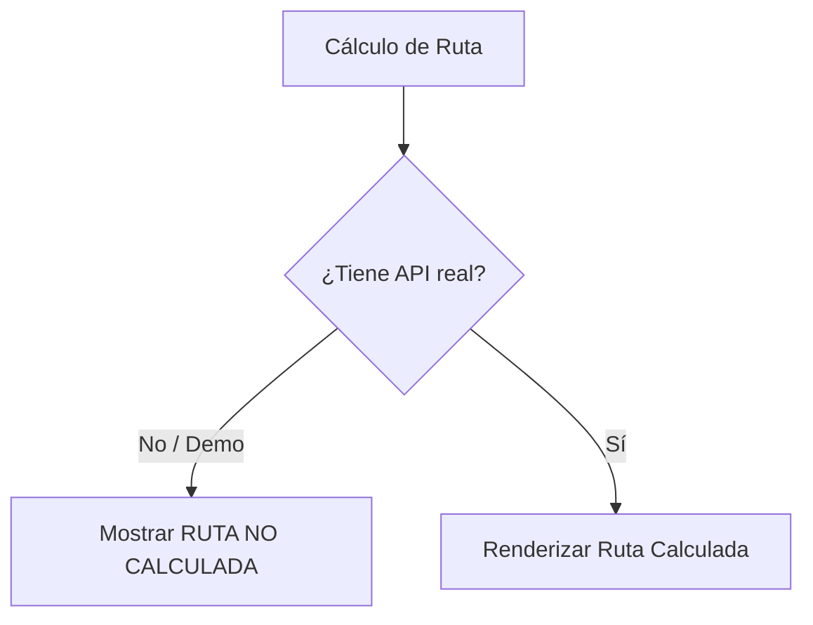

# Regla Contra Rutas Falsas (Phase 019)

## Regla de Negocio
Queda estrictamente prohibido simular polilíneas o rutas inventadas. Si no hay cálculo real de API externa, se muestra `RUTA NO CALCULADA`.

## Flujo de la Regla

