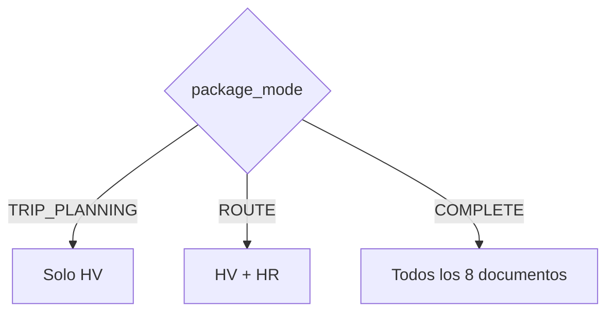

# Paquete Documental de Transporte (Phase 019)

## Reglas de Inclusión
- `HV`: Incluido siempre.
- `HR`: Incluido si hay ruta.
- `CVT`: Incluido en modo inspección.
- `POD` / `EP` / `RECH`: Incluidos según resultado de entrega.

## Reglas de Inclusión

