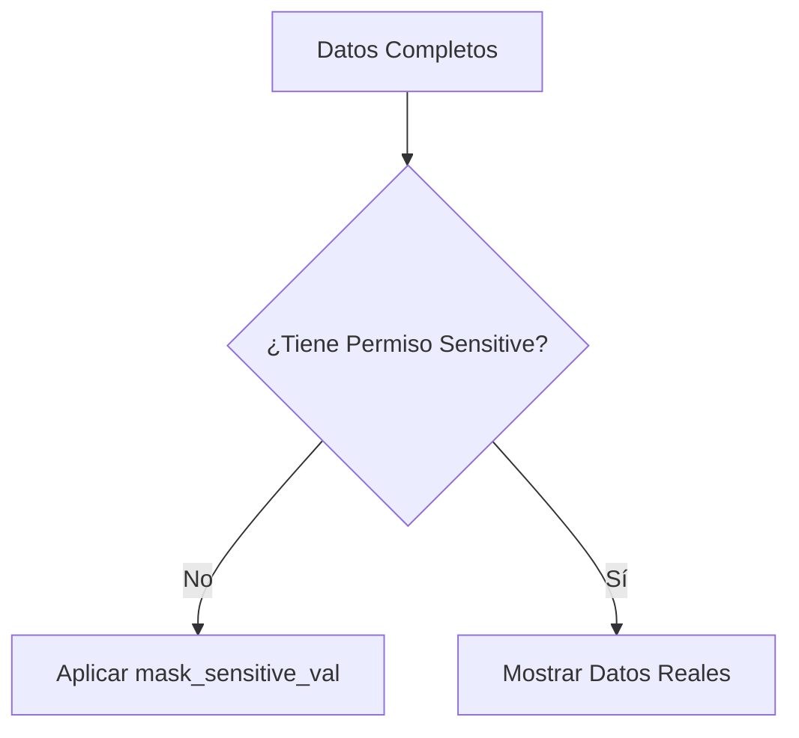

# Privacidad y Enmascaramiento (Phase 019)

## Enmascaramiento de Datos
Si el usuario carece del permiso `read_sensitive`, se enmascaran:
- DNI/Licencia del conductor (ej. `******34`).
- Teléfono y email del cliente receptor.
- Firmas y fotos (muestran aviso de "Protegido").

## Flujo de Enmascaramiento

