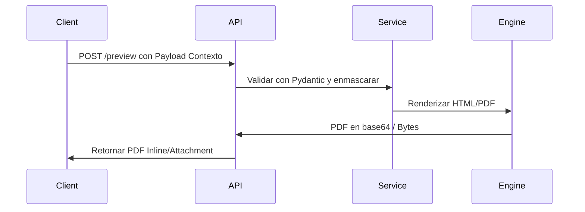

# Endpoints de la API (Phase 019)

## Endpoints de Transporte y Entrega
- `/api/logistics/transport/documents/{document_type_code}/preview`
- `/api/logistics/transport/documents/{document_type_code}/pdf`
- `/api/logistics/transport/document-package/manifest`
- `/api/logistics/transport/document-package/preview`
- `/api/logistics/delivery/documents/{document_type_code}/preview`
- `/api/logistics/delivery/documents/{document_type_code}/pdf`

## Secuencia de Endpoints

