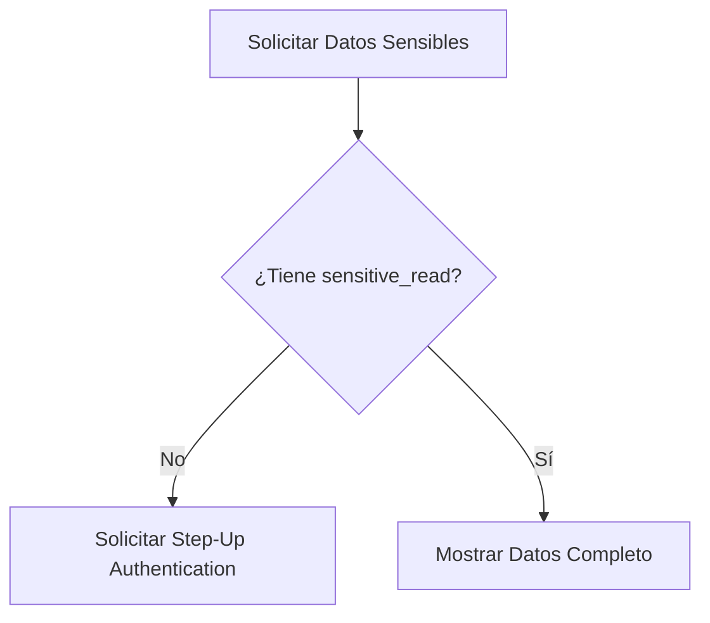

# Permisos y Step-Up (Phase 019)

## Matriz de Permisos
- `logistics.transport_documents.read`: Permite previsualizar documentos de transporte.
- `logistics.transport_documents.read_sensitive`: Permite visualizar DNI/Licencias.

## Flujo Step-Up

