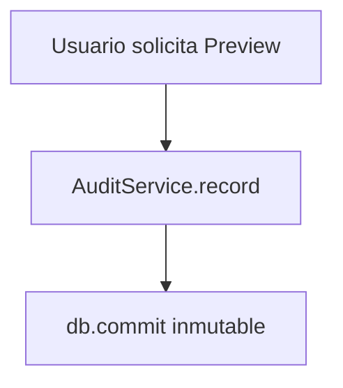

# Auditoría Inmutable (Phase 019)

## Eventos de Auditoría
- `logistics.transport_document.preview_rendered`
- `logistics.transport_document.preview_downloaded`
- `logistics.transport_document.package_manifest_created`
- `logistics.delivery_document.preview_rendered`

## Flujo de Registro

