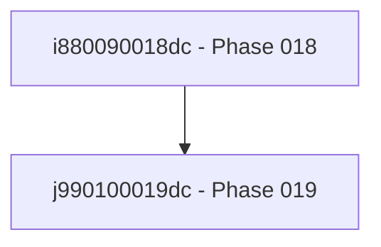

# Migración y Semillado (Phase 019)

## Migración Alembic
La migración `j990100019dc` registra los códigos propuestos `CVT` y `PAR`.

## Árbol de Migraciones

```mermaid
graph TD
    i880090018dc[i880090018dc - Phase 018] --> j990100019dc[j990100019dc - Phase 019]
```
