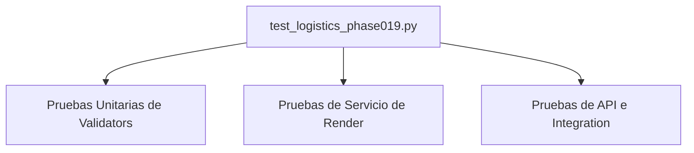

# Pruebas de Integración (Phase 019)

## Suite de Pruebas
Las pruebas unitarias y de integración se localizan en `tests/test_logistics_phase019.py`.

## Estructura de Suite

```mermaid
graph TD
    TestClass[test_logistics_phase019.py] --> Unit[Pruebas Unitarias de Validators]
    TestClass --> Serv[Pruebas de Servicio de Render]
    TestClass --> API[Pruebas de API e Integration]
```
