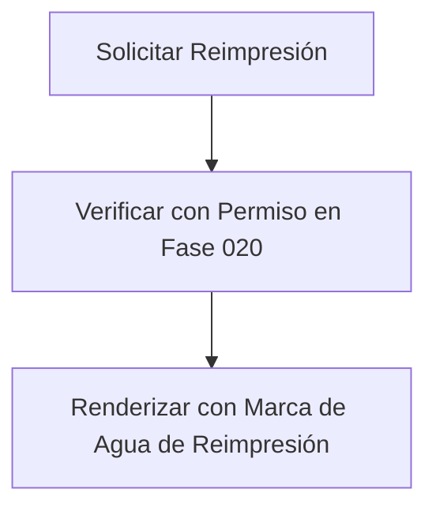

# Contrato con la Fase 020 (Phase 019)

## Reimpresión y Anulación
Todos los documentos de transporte y entrega (`HV`, `HR`, `CVT`, `PAR`, `INC`, `POD`, `EP`, `RECH`) se integrarán con la Fase 020 para habilitar su reimpresión y anulación oficial.

## Pipeline de Reimpresión

